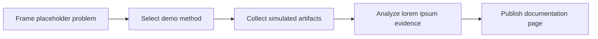

Lorem ipsum dolor sit amet, consectetur adipiscing elit. This page demonstrates methodology documentation with steps, comparative tables, callouts, Mermaid diagrams, code blocks, and mathematical notation.

## Methodology Cards


  
  
  
  


## Process

{}

### Define the unit of analysis

Lorem ipsum dolor sit amet, consectetur adipiscing elit. Etiam sit amet orci eget eros faucibus tincidunt.

### Select a placeholder method

Donec quam felis, ultricies nec, pellentesque eu, pretium quis, sem. Nulla consequat massa quis enim.

### Map evidence and constraints

Integer tincidunt. Cras dapibus. Vivamus elementum semper nisi. Aenean vulputate eleifend tellus.

### Report the simulated findings

Aenean leo ligula, porttitor eu, consequat vitae, eleifend ac, enim. Aliquam lorem ante dapibus in.

{}

## Comparison Table

| Method | Best Placeholder Fit | Inputs | Outputs |
|---|---|---|---|
| Experimental | Metric-oriented lorem ipsum | Baselines, variables | Synthetic result table |
| Qualitative | Interpretive lorem ipsum | Notes, interviews | Theme matrix |
| Mixed Methods | Multi-signal lorem ipsum | Logs, ratings, memos | Integrated findings |
| Design Science | Artifact-oriented lorem ipsum | Requirements, prototypes | Evaluation narrative |

## Workflow Diagram



## Math Block


S_{demo} = \frac{\sum_{i=1}^{n} w_i x_i}{n}



The equation is illustrative. It does not define a real research metric.


## Pseudo Protocol

```python
def evaluate_placeholder(study):
    protocol = ["scope", "sample", "measure", "review"]
    return {step: "lorem ipsum" for step in protocol}
```

{}
- [x] Scope is described with placeholder language.
- [x] Artifacts are named but not real.
- [x] Limitations are visible.
- [ ] Empirical claims are intentionally absent.
{}
